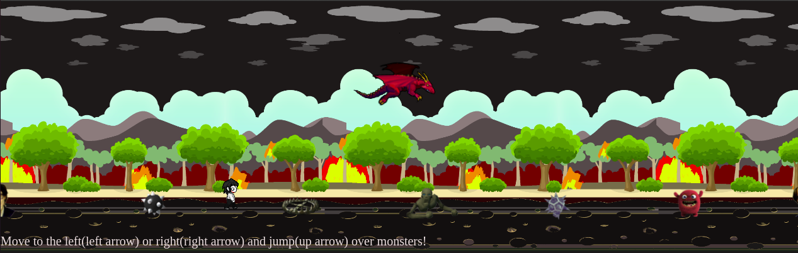
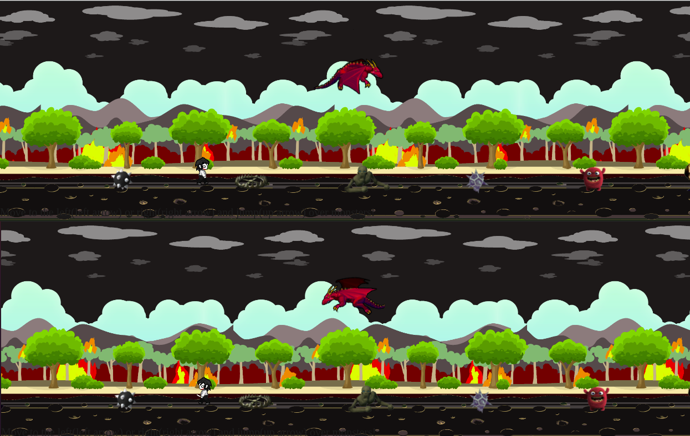
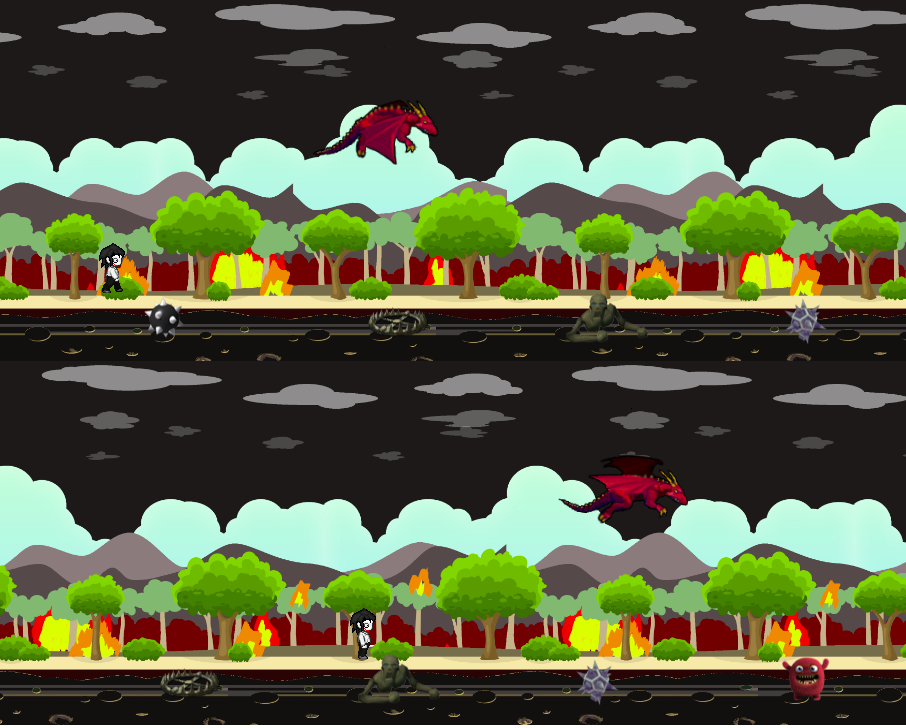

# Endless runner game

### Back to Front-end!
We are starting our specialization month. And after we were busy with back-end languages and frameworks such as .NET, Symfony, PHP, C# it is time to move my focus back on front-end.
### This is an exercise is related to my first animation created by parallax effect and JavaScript.

>[Michaela Harinova](https://github.com/mharin)

#### A little project (learning-challenge) to repeat and improve Javascript, CSS and HTML.

## Used technologies:
- JavaScript
- CSS
- HTML
- Gimp

## The Mission
> - A page with a moving background that looks natural
> - Upgrade it based on your own choice
> - #### I went for:
    > apocalyptic theme by adjusting original layers
    > a platform game / endless runner
    > enhance the scenery with some characters
    > all characters can move to the left or right

## Interface of my "Endless runner game"
>#### Walk to both sides
>

>#### Jump over monsters and traps
>

